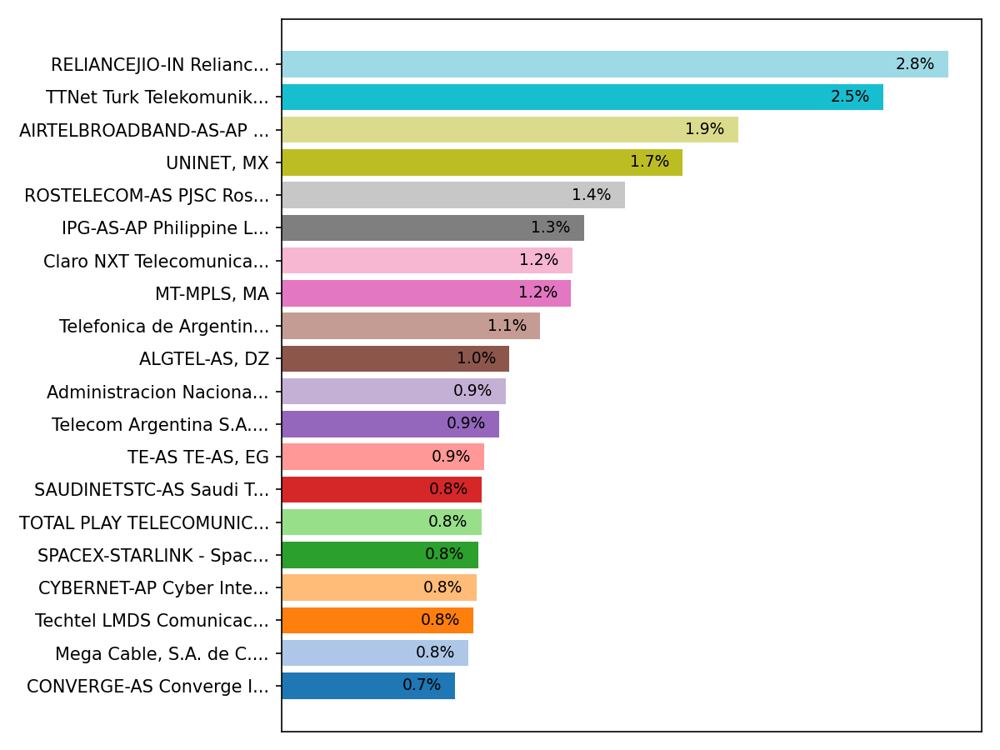
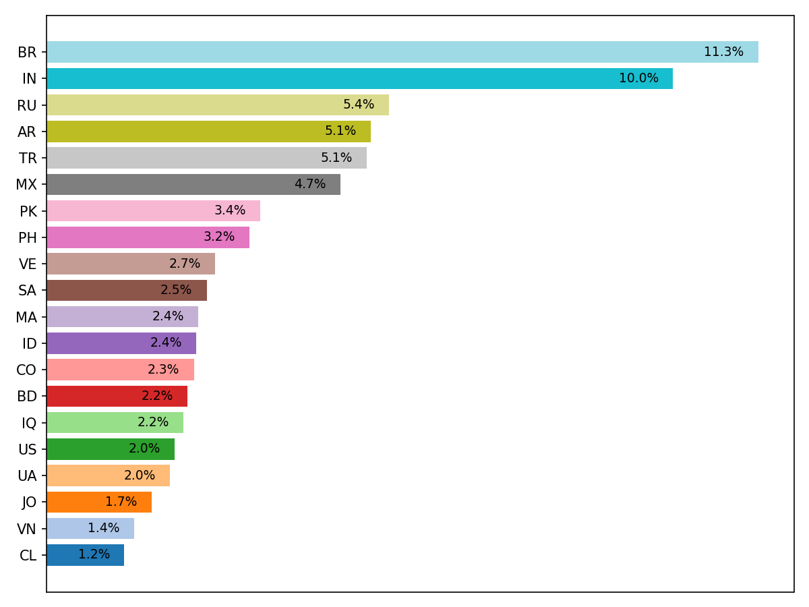
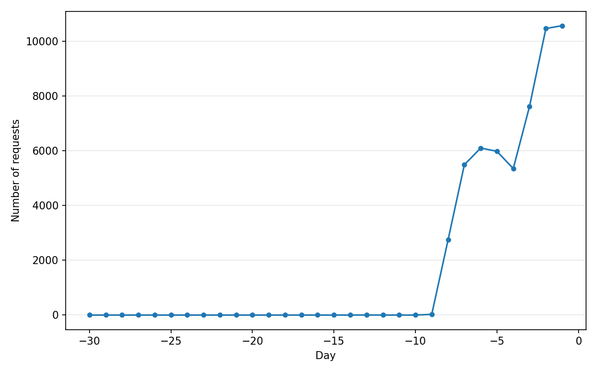

This repository contains lists of ASN (autonomous system numbers) and IPs
that are in use by data scrapers (often for the purpose of AI model
training), exploit scanners, and other miscellaneous malicious purposes.

## List index

### Scraper lists

  - [`scraper-asn.txt`](scraper-asn.txt): These AS are solely used to
    scrape your pages and nothing else.
  - [`scraper-ips.txt`](scraper-ips.txt): These IP ranges are advertised
    with the ASN of large internet providers, but are leased by data
    mining companies.

No real user traffic or benign bot will ever originate from here. This one
**recommends dropping all traffic** from them outright!

### Hosting lists

  - [`hosting-asn.txt`](hosting-asn.txt): These ASNs are assigned to
    datacenters, colocation, cloud, VPS or VPN providers.
  - [`hosting-ips.txt`](hosting-ips.txt): These ranges are owned by large
    ISPs and advertised using their ASN, but are actually leased for use by
    hosting providers.

Mizarka recommends that you **do not completely block** requests
originating from these ranges, as they are used not only by unwanted bots,
but also innocent, real users behind VPNs.

Instead, you should consider serving them an **interactive challenge**
before letting them through. Automated challenges, such as JS proof-of-work
solutions, are futile since the headless browsers most bots use are fully
capable of executing them unattended with minimal delay.

### Residential proxy IPs

  - [`residential-proxy-ips.txt`](residential-proxy-ips.txt): List of IPs
    that have sent multiple botnet requests on different days in the last
    30 days.
  - [`residential-proxy-ips-all.txt`](residential-proxy-ips-all.txt): Full
    list of IPs that have sent at least one botnet request in the last 30
    days.

These IPs belong to real, residential/home internet providers, but their
users are knowingly or unknowingly part of residential IP proxy networks:
they are running software that allows third parties to perform requests
using their internet connection, for the sole purpose of hiding in the
shadows.

As these IPs are often dynamically assigned, this one recommends that you
use an **interactive challenge** rather than blocking them, as they will
be eventually assigned to another, legitimate user.

## Q&A

**How are you building this?**

All lists are built based on access patterns and browser fingerprinting,
gathered from multiple servers hosted through the internet.

The residential IP proxy list is built heuristically based on the last
month of data. The others are built manually.

**Where is the information coming from?**

Mizarka's process depends on obscurity. Publicly documenting this process
would allow scrapers to skip his vantage points, reducing the amount and
quality of the data.

Thus, this one will keep it a secret. ❤️

## Residential IP statistics

These statistics are calculated for the last 30 days, and they exclude all
known hosting and scraping AS.

### Per AS

### Per country

### Requests per day

